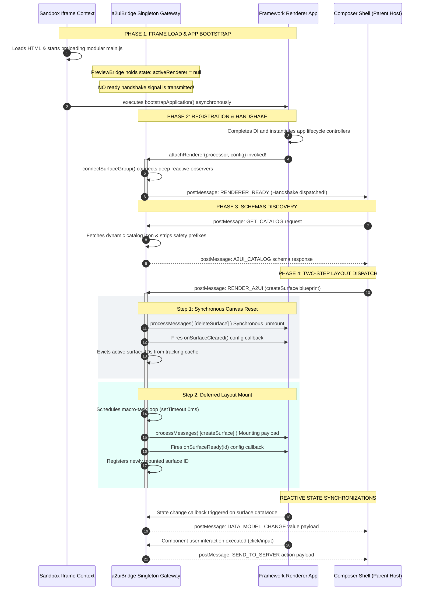

# A2UI Composer Integration Manual

The A2UI Composer application hosts and isolates individual component rendering
engines (e.g., Lit, Angular, React) within isolated iframe contexts to maintain
secure cross-origin boundary controls.

All inter-frame communication is mediated via the postMessage protocol by the
`PreviewBridge` singleton gateway from the `a2ui-bridge` package.

This manual provides a step-by-step guide to exposing your component catalogs
and rendering stacks to the Composer.

---

## ⚛️ Integrating a React Component Catalog

See the [react-basic-catalog](samples/react-basic-catalog/README.md) as an
example.

React rendering engines use a custom hook to establish the sandbox connection.

### Step 1: Install dependencies

Add the core integration package to your project dependencies list:

```bash
yarn add a2ui-bridge
```

### Step 2: Bootstrap your sandbox application

Use the `useA2uiSandbox` hook in your root component (e.g., `src/App.tsx`) to
manage the sandbox lifecycle and obtain the active surface model:

```typescript
import {useA2uiSandbox} from 'a2ui-bridge/react';
import {A2uiSurface, basicCatalog} from '@a2ui/react/v0_9';

export function App() {
  const {surface} = useA2uiSandbox([basicCatalog]);

  return (
    <main className = "sandbox-shell" >
      {
        surface ?
          (<A2uiSurface surface = {surface}/>) :
          ( <p>A2UI React Sandbox active .Waiting for RENDER_A2UI payloads...</p>)
      }
    </main>
  );
}
```

---

## 🅰️ Integrating an Angular Component Catalog

See the [ng-basic-catalog](samples/ng-basic-catalog/README.md) as an
example.

To maximize performance, the Angular integration separates view-rendering
elements from core package controllers. This allows Angular's own compiler CLI
(`ngtsc`) to perform native, pure **Ahead-of-Time (AOT)** template compilations
on markup.

Exposing your Angular catalogs involves exactly three steps:

### Step 1: Create the local visual-wrapper component

Define a logic-free host view shell component in your local sandbox directory
(`src/app/app.component.ts`). Ingest the signals from the central
`A2uiSandboxConnection` lifecycle controller:

```typescript
import {Component, inject} from '@angular/core';
import {SurfaceComponent} from '@a2ui/angular/v0_9';
import {A2uiSandboxConnection} from 'a2ui-bridge/angular';

@Component({
  selector: 'app-root',
  standalone: true,
  imports: [SurfaceComponent],
  template: `
    <main class="sandbox-shell">
      @if (sandbox.surfaceId()) {
        <a2ui-v09-surface [surfaceId]="sandbox.surfaceId()" />
      } @else {
        <p style="padding: 24px; color: #666; font-family: sans-serif; text-align: center;">
          Waiting for RENDER_A2UI payloads...
        </p>
      }
    </main>
  `,
})
export class AppComponent {
  protected sandbox = inject(A2uiSandboxConnection);
}
```

### Step 2: Bootstrap your sandbox application

Configure the standard Angular bootstrapping entrypoint file (`src/main.ts`)
using platform APIs, passing your catalog classes dynamically to the sandbox
provider mapping:

```typescript
import {bootstrapApplication} from '@angular/platform-browser';
import {AppComponent} from './app/app.component';
import {provideA2uiSandbox} from 'a2ui-bridge/angular';
import {BasicCatalog} from '@a2ui/angular/v0_9';

bootstrapApplication(AppComponent, {
  providers: [
    provideA2uiSandbox([BasicCatalog]), // Injects and exposes dynamic catalogs
  ],
}).catch(err => console.error('A2UI Sandbox Bootstrap Failed:', err));
```

> [!NOTE]
> **Change Detection Compatibility**: The `provideA2uiSandbox` helper is 100%
> compatible with both standard Zone-based change detection (using `zone.js`)
> and Zoneless change detection (`provideZonelessChangeDetection()`)
> out-of-the-box.
> If your sandbox application is already configured to run under Zoneless mode,
> simply retain `provideZonelessChangeDetection()` inside the bootstrapping
> `providers` array alongside `provideA2uiSandbox`. No structural changes are
> required.

---

## 💡 Integrating a Lit Component Catalog

See the [lit-basic-catalog](samples/lit-basic-catalog/README.md) as an
example.

Lit rendering engines operate dynamically and do not require pre-compilation
steps inside the library package. Exposing your Lit catalogs involves exactly
three steps:

### Step 1: Install dependencies

Add the core integration package to your project dependencies list:

```bash
yarn add a2ui-bridge
```

### Step 2: Bootstrap your dynamic sandbox

Import `bootstrapLitSandbox` from the Lit-specific subpath, and provide your
catalog definitions inside your entrypoint file (`src/main.ts`):

```typescript
import {bootstrapLitSandbox} from 'a2ui-bridge/lit';
import {basicCatalog} from '@a2ui/lit/v0_9';

// Bootstraps, registers element tag names, and mounts the Lit sandbox:
bootstrapLitSandbox([basicCatalog]);
```

### Step 3: Resolve duplicate dependency nominal mismatches

Under Yarn workspaces layouts featuring multiple active versions of
`@a2ui/web_core`, the TypeScript compiler strictly blocks type assignments on
private class fields (e.g., `DataModel`). To bypass this nominal type check
safely without resorting to dynamic `any` castings, apply a safe double-typecast
to the catalog using the workspace's own fully-typed base interfaces:

```typescript
import {bootstrapLitSandbox} from 'a2ui-bridge/lit';
import {basicCatalog} from '@a2ui/lit/v0_9';
import {Catalog, ComponentApi} from '@a2ui/web_core/v0_9';

// Exposes the Lit element mapping cast-free using standard workspace interfaces:
export const AppRoot = bootstrapLitSandbox([basicCatalog as unknown as Catalog<ComponentApi>]);
```

---

## 📋 Providing the Catalog to the Shell

The Composer Shell needs to know the component catalog to render the UI. There
are two ways a renderer application can provide this catalog:

### 1. In-Memory Catalog

You can pass the catalog JSON directly to the integration helper or hook. This
is the recommended approach if you want to bundle the catalog with the renderer
application.

- **React**: Pass `catalogJson` in `ReactSandboxOptions` to `useA2uiSandbox`:

  ```typescript
  import {useA2uiSandbox} from 'a2ui-bridge/react';
  import {basicCatalog} from '@a2ui/react/v0_9';
  import catalogJson from './assets/catalog.json';

  // Inside your component:
  const {surface} = useA2uiSandbox([basicCatalog], {catalogJson});
  ```

- **Angular**: Pass `catalogJson` in `AngularSandboxOptions` to
  `provideA2uiSandbox`:

  ```typescript
  import {provideA2uiSandbox} from 'a2ui-bridge/angular';
  import {BasicCatalog} from '@a2ui/angular/v0_9';
  import catalogJson from './assets/catalog.json';

  provideA2uiSandbox([BasicCatalog], {catalogJson});
  ```

- **Lit**: Pass `catalogJson` in `LitSandboxOptions` to `bootstrapLitSandbox`:

  ```typescript
  import {bootstrapLitSandbox} from 'a2ui-bridge/lit';
  import {basicCatalog} from '@a2ui/lit/v0_9';
  import catalogJson from './assets/catalog.json';

  bootstrapLitSandbox([basicCatalog], {catalogJson});
  ```

### 2. Endpoint-Based Catalog (Fetched by Bridge)

If you do not provide `catalogJson` in the options, the `PreviewBridge` will
automatically attempt to fetch the catalog from the hosting server.

It will try to fetch from the following endpoints relative to the renderer's
origin:

1. `/catalog`
2. `/catalog.json` (fallback if `/catalog` returns HTML, which often happens in
   Single Page Applications due to fallback routing)

Ensure your server is configured to serve the catalog JSON at one of these
paths. For example, in Vite-based projects (like Lit and React samples), you can
place the catalog JSON file named `catalog` (without extension) in the `public`
directory.

---

## 🛠️ Advanced Custom Integration Flow (Optional)

If your environment requires a custom visual container setup, such as diagnostic
sidebar panels, custom title banners, or telemetry tracking configurations
framing the sandbox element canvas, you can manually wire the integration using
the raw `attachRenderer` API:

### Step 1: Initialize the core catalog processor

Initialize the catalog processor wrapper and wire the dynamic actions outbox
proxy using the bridge's static sender API:

```typescript
import {MessageProcessor, Catalog, ComponentApi} from '@a2ui/web_core/v0_9';
import {myCatalog} from './my-catalog';
import {a2uiBridge} from 'a2ui-bridge';

const processor = new MessageProcessor([myCatalog as unknown as Catalog<ComponentApi>], action => {
  // Pipelines user clicks and values modifications back to the Composer
  a2uiBridge.sendAction(action);
});
```

### Step 2: Connect your custom container component

Call `attachRenderer` on the bridge singleton to register your framework
processor, surface groups, and lifecycle mounting hooks:

```typescript
import {a2uiBridge, SurfaceStateSubscription} from 'a2ui-bridge';

let connection: SurfaceStateSubscription | null = null;
let activeSurface: any = null;

connection = a2uiBridge.attachRenderer(processor, {
  surfaceGroup: processor.model,
  onSurfaceReady: (surfaceId: string) => {
    // Inject the resulting surface into your custom view context
    activeSurface = processor.model.getSurface(surfaceId);
    triggerViewUpdate();
  },
  onSurfaceCleared: () => {
    // Clear active canvas elements on unmount triggers
    activeSurface = null;
    triggerViewUpdate();
  },
});
```

### Step 3: Dispose active subscriptions (Cleanup Procedures)

To prevent memory leaks, duplicate log entries, and performance degradation
during hot-reloads or routing changes, always execute cleanup procedures. This
involves disposing of active subscription hooks when the component unmounts:

```typescript
function onDestroy() {
  if (connection) {
    connection.unsubscribe();
    connection = null;
  }
}
```

If you are managing surfaces manually, ensure any allocated elements or memory
tied to the surface are released during the `onSurfaceCleared` callback.

---

## 🏛️ Appendix: Under-the-Hood Messaging & Lifecycle Sequencing

### 1. Strict Linear Handshake Pipeline

To eliminate inter-frame race conditions occurring under heavy parallel worker
execution loads or latency spikes, the communication pipeline strictly
coordinates startups using a linear lifecycle sequence:



- **The Timing Gap**: Standard browser scripts annotated as modules
  (`type="module"`) are deferred, executing after the browser transitions
  `document.readyState` to interactive. angular/lit bootstraps and dynamic
  dependencies injections are highly asynchronous.
- **The Deferral Remedy**: By deferring the `RENDERER_READY` handshake
  postMessage until `attachRenderer()` executes (after the renderer app has
  fully booted and connected), the bridge gateway **guarantees that when the**
  **parent Shell returns layout blueprint messages, the sandbox is already**
  **attached and ready to draw.** This structurally prevents dynamic setups from
  arriving out-of-order and being lost.

### 2. Message Protocols

The communication relies on a defined set of message payloads over
`postMessage`:

- `RENDERER_READY`: Sent by the Bridge to notify the Composer that
  `attachRenderer` was called and the renderer is prepared to accept commands.
  The Composer uses a concurrency lock (`isHandshakeInProgress`) to prevent
  overlapping setups.
- `GET_CATALOG` / `A2UI_CATALOG`: The Composer requests the catalog definitions.
  The Bridge responds with the `A2UI_CATALOG` schema. The Composer processes
  this via `safe-stable-stringify` (canonical key sorting) and hashes it
  (`crypto.subtle.digest('SHA-256')`). Only changed catalogs trigger an
  IndexedDB storage update.
- `RENDER_A2UI`: Dispatched by the Composer to dictate the UI structure. The
  payload includes instructions like `createSurface` or `deleteSurface` based on
  the active session state.
- `DATA_MODEL_CHANGE`: Sent by the Renderer (via the Bridge) to inform the
  Composer of state mutations within the rendered components.
- `SEND_TO_SERVER`: Dispatched when user interactions (e.g., button clicks)
  trigger an action intended for the backend server or Gemini API.

> [!IMPORTANT]
> **Security & Origin Validation**: To ensure safe cross-origin communication,
> the Composer Shell rigorously validates the `event.origin` of all incoming
> `postMessage` requests against the expected URL provided by the
> `StartupResolutionService`. Renderers must be hosted on trusted, specified
> origins to communicate successfully.

### 3. Two-Step Layout Dispatch

When a new layout surface creation instruction arrives (`RENDER_A2UI` with
`createSurface` inside the payload), the bridge singleton routes execution
through a double-tick scheduled sequence to bypass dynamic flickering, timing
crashes, and DOM node leaks:

1. **Phase A (Synchronous Reset)**: Instantly processes `deleteSurface` commands
   on all active surface IDs. Fires the `onSurfaceCleared` lifecycle callback to
   synchronous unmount and dispose of the existing elements tree.
2. **Phase B (Deferred Mount)**: Postpones target layout paints using a deferred
   browser event tick (`setTimeout(..., 0)`). Intercepts and executes the target
   `createSurface` and child component render loops, firing `onSurfaceReady` to
   paint the fresh, empty canvas, ensuring a smooth visual transition.
