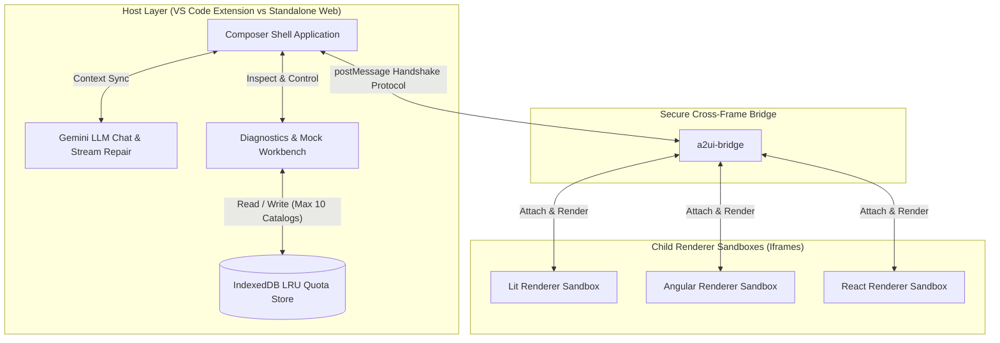

# A2UI Composer

_Real-Time Visual Authoring, Live-Preview & Debugging Workbench for A2UI._

[](https://opensource.org/licenses/Apache-2.0)
[](https://nodejs.org/)
[](https://yarnpkg.com/)
[](https://angular.dev/)

_Screenshot:_


_Demo video:_

https://github.com/user-attachments/assets/6ce76648-9dbd-4ada-ba2c-eea005f6f983

_Note: Interactions with the LLM have been sped up in the video._

## Executive Summary & Value Proposition

**A2UI Composer** is a purely client-side, serverless, framework-agnostic
real-time visual design, live-editing, and debugging ecosystem for Agent-Driven
User Interfaces ([A2UI](https://a2ui.org/)).

Agent created A2UI JSON is not friendly for developers to read, nor can they see
what the result actually looks like without building a full end-to-end
application leveraging A2UI or integrating with an existing one.

A2UI Composer eliminates this friction by establishing an A2UI catalog agnostic,
live-preview sandbox that embeds developer-provided component renderers directly
inside an automated feedback loop alongside real-time Gemini LLM assistance.
Operating entirely without backend infrastructure to eliminate deployment
overhead, it runs seamlessly as a standalone web application.

## Core Features & Capabilities

- **Gemini LLM Assistant**: Stream-enabled chat interface specifically for
  constructing and iterating on A2UI schemas.
- **Bidirectional Live Editing & Background Context Sync**: Tweak raw JSON
  layout definitions or Data Model state trees on the fly. Updates trigger
  immediate visual hot-reloading and silently synchronize back into the LLM
  conversation history via `<system>` sync messages.
- **Advanced Debugging & Diagnostics Workbench (Bottom Panel)**:
  - **Data Model**: Interactive JSON state tree inspector and state simulator.
  - **Events**: Traceable log of intercepted user interactions.
  - **Errors**: Traps iframe `console.error/warn/...` as well as `window.error`,
    unhandled exceptions, and A2UI schema validation faults.
  - **Raw Messages**: Real-time display of messages between the A2UI Composer
    and the renderer app, as well as messages to and from the LLM.
- **Zero-Touch Catalog Discovery**: Automated handshake fetching the complete
  catalog.

## High-Level System Architecture

A2UI Composer enforces clean structural decoupling across origin boundaries via
a message gateway (`a2ui-bridge`).

### System Architecture Diagram



## Monorepo Topology (`package.json` Workspaces)

The ecosystem is architected as a modular, highly cohesive monorepo utilizing
**Yarn v4 Workspaces**:

| Workspace      | Package Name                                                       | Description & Core Responsibilities                                                                                                                                                 |
| :------------- | :----------------------------------------------------------------- | :---------------------------------------------------------------------------------------------------------------------------------------------------------------------------------- |
| **`shell/`**   | `a2ui-composer-shell`                                              | Standalone web application hosting chat panel, live JSON editors, real-time iframe preview wrapper, debugging suite, interactive mock rules manager, and IndexedDB storage engines. |
| **`bridge/`**  | `a2ui-bridge`                                                      | ESBuild-bundled lightweight cross-frame JavaScript library embedded inside child rendering iframes.                                                                                 |
| **`samples/`** | `ng-basic-catalog`<br>`lit-basic-catalog`<br>`react-basic-catalog` | Plug-and-play developer renderer sandbox applications demonstrating zero-boilerplate integration across Lit, Angular, and React rendering stacks.                                   |

## Getting Started

### Prerequisites

Ensure your local workspace is configured with the following dependencies:

- **Node.js**: v24+
- **Package Manager**: Yarn v4 Corepack enabled (`corepack enable`)
- **Code Formatter**: Prettier

### Starting the A2UI Composer

```bash
# Install monorepo workspace dependencies via Yarn v4
yarn install

# Launch one (or more) of the sample renderer apps. By default:
#   ng-basic-catalog starts on localhost:3456
#   lit-basic-catalog starts on localhost:3457
#   react-basic-catalog starts on localhost:3458
yarn --cwd samples/ng-basic-catalog start
yarn --cwd samples/lit-basic-catalog start
yarn --cwd samples/react-basic-catalog start

# Launch standalone interactive development shell on http://localhost:4200
yarn --cwd shell start
```

When the A2UI Composer starts, if this is your first time using it, you'll be
automatically routed to the Settings page, where you will need to enter the URL
of the renderer app you want to use (e.g., "http://localhost:3456).

You'll also need to enter a Gemini API key. If you don't plan on using the chat
panel to help build A2UI interfaces, you can just enter any text; know that in
this case you'll get an error if you try to use the chat.

### Using A2UI Composer

After configuring the renderer app (see above) and your Gemini API key, you can
use the chat panel on the left to describe the interface you want created.

Once the A2UI JSON for your interface is rendered, you can:

- Use the chat panel to request changes
- Manually edit the A2UI JSON in the panel on the far right
- Watch the data model changes in the Data Model debugging tab
- Watch the events that would be sent back to the agent (often triggered by
  button clicks) in the Events tab
- See console.log/warn/error and window.onerror messages in the Errors tab
- Follow all the details, including messages being sent to and received from the
  LLM in the chat panel, by following the Raw Messages.

Once you are happy with the A2UI JSON, you can copy it and then integrate it as
a template in your Agent or Skill.

### Integrating Your A2UI Catalog & Renderers

There are fundamentally two steps to integrate your catalog and renderers into
the A2UI Composer:

1. Bootstrap your sandbox application
2. Provide your Catalog to the A2UI Composer

See the [integration manual](./INTEGRATION_MANUAL.md) for complete details.

## Contributing

We welcome contributions to the A2UI Composer ecosystem! Please review
our [CONTRIBUTING.md](./CONTRIBUTING.md) for complete guidelines on opening pull
requests, running validation suites, and signing the Contributor License
Agreement.

Before submitting any code changes, run our automated formatting tool and ensure
all tests pass:

```bash
./scripts/fix_format.sh

# Run full monorepo type verification across shell and bridge
yarn build

# Execute unit test verification with V8 coverage across all workspaces
yarn test

# Run Playwright user journey validation before commit
yarn --cwd shell e2e-headless
```

## License

This software is distributed under the **Apache 2.0 License**. See
the [LICENSE](./LICENSE) document for explicit licensing rights and limitations.
