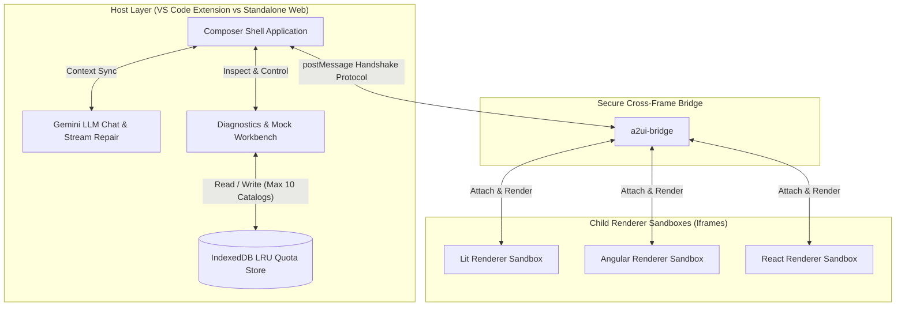

# A2UI Composer

_Real-Time Visual Authoring, Live-Preview & Debugging Workbench for A2UI._

[](https://opensource.org/licenses/Apache-2.0)
[](https://nodejs.org/)
[](https://yarnpkg.com/)
[](https://angular.dev/)

_Screenshot:_


_Demo video:_

https://github.com/user-attachments/assets/6ce76648-9dbd-4ada-ba2c-eea005f6f983

_Note: Interactions with the LLM have been sped up in the video._

## Executive Summary & Value Proposition

**A2UI Composer** is a purely client-side, serverless, framework-agnostic
real-time visual design, live-editing, and debugging ecosystem for Agent-Driven
User Interfaces ([A2UI](https://a2ui.org/)).

Agent created A2UI JSON is not friendly for developers to read, nor can they see
what the result actually looks like without building a full end-to-end
application leveraging A2UI or integrating with an existing one.

A2UI Composer eliminates this friction by establishing an A2UI catalog agnostic,
live-preview sandbox that embeds developer-provided component renderers directly
inside an automated feedback loop alongside real-time Gemini LLM assistance.
Operating entirely without backend infrastructure to eliminate deployment
overhead, it runs seamlessly as a standalone web application.

## Core Features & Capabilities

- **Gemini LLM Assistant**: Stream-enabled chat interface specifically for
  constructing and iterating on A2UI schemas.
- **Bidirectional Live Editing & Background Context Sync**: Tweak raw JSON
  layout definitions or Data Model state trees on the fly. Updates trigger
  immediate visual hot-reloading and silently synchronize back into the LLM
  conversation history via `<system>` sync messages.
- **Advanced Debugging & Diagnostics Workbench (Bottom Panel)**:
  - **Data Model**: Interactive JSON state tree inspector and state simulator.
  - **Events**: Traceable log of intercepted user interactions.
  - **Errors**: Traps iframe `console.error/warn/...` as well as `window.error`,
    unhandled exceptions, and A2UI schema validation faults.
  - **Raw Messages**: Real-time display of messages between the A2UI Composer
    and the renderer app, as well as messages to and from the LLM.
- **Zero-Touch Catalog Discovery**: Automated handshake fetching the complete
  catalog.

## High-Level System Architecture

A2UI Composer enforces clean structural decoupling across origin boundaries via
a message gateway (`a2ui-bridge`).

### System Architecture Diagram


```mermaid
flowchart TD
    subgraph Host ["Host Layer (VS Code Extension vs Standalone Web)"]
        Shell["Composer Shell Application"]
        Chat["Gemini LLM Chat & Stream Repair"]
        Workbench["Diagnostics & Mock Workbench"]
        Store[("IndexedDB LRU Quota Store")]
    end

    subgraph BridgeLayer ["Secure Cross-Frame Bridge"]
        Bridge["a2ui-bridge"]
    end

    subgraph Renderers ["Child Renderer Sandboxes (Iframes)"]
        LitSandbox["Lit Renderer Sandbox"]
        AngSandbox["Angular Renderer Sandbox"]
        ReactSandbox["React Renderer Sandbox"]
    end

    Shell <-->|"Context Sync"| Chat
    Shell <-->|"Inspect & Control"| Workbench
    Workbench <-->|"Read / Write (Max 10 Catalogs)"| Store

    Shell <-->|"postMessage Handshake Protocol"| Bridge
    Bridge <-->|"Attach & Render"| LitSandbox
    Bridge <-->|"Attach & Render"| AngSandbox
    Bridge <-->|"Attach & Render"| ReactSandbox
```

## Monorepo Topology (`package.json` Workspaces)

The ecosystem is architected as a modular, highly cohesive monorepo utilizing
**Yarn v4 Workspaces**:

| Workspace      | Package Name                                                                                | Description & Core Responsibilities                                                                                                                                                 |
| :------------- | :------------------------------------------------------------------------------------------ | :---------------------------------------------------------------------------------------------------------------------------------------------------------------------------------- |
| **`shell/`**   | `a2ui-composer-shell`                                                                       | Standalone web application hosting chat panel, live JSON editors, real-time iframe preview wrapper, debugging suite, interactive mock rules manager, and IndexedDB storage engines. |
| **`bridge/`**  | `a2ui-bridge`                                                                               | ESBuild-bundled lightweight cross-frame JavaScript library embedded inside child rendering iframes.                                                                                 |
| **`samples/`** | `ng-basic-catalog`<br>`lit-basic-catalog`<br>`react-basic-catalog`<br>`react-slack-catalog` | Plug-and-play developer renderer sandbox applications demonstrating zero-boilerplate integration across Lit, Angular, React, and a credential-free Slack Block Kit preview.         |

## Getting Started

### Prerequisites

Ensure your local workspace is configured with the following dependencies:

- **Node.js**: v24+
- **Package Manager**: Yarn v4 Corepack enabled (`corepack enable`)
- **Code Formatter**: Prettier

### Starting the A2UI Composer

```bash
# Install monorepo workspace dependencies via Yarn v4
yarn install

# Build the shared iframe bridge package used by sample renderer apps
yarn workspace a2ui-bridge build

# Launch one (or more) of the sample renderer apps. By default:
#   ng-basic-catalog starts on localhost:3456
#   lit-basic-catalog starts on localhost:3457
#   react-basic-catalog starts on localhost:3458
#   react-slack-catalog starts on localhost:3459
yarn --cwd samples/ng-basic-catalog start
yarn --cwd samples/lit-basic-catalog start
yarn --cwd samples/react-basic-catalog start
yarn --cwd samples/react-slack-catalog start

# Launch standalone interactive development shell on http://localhost:4200
yarn --cwd shell start
```

When the A2UI Composer starts, if this is your first time using it, you'll be
automatically routed to the Settings page, where you will need to enter the URL
of the renderer app you want to use (e.g., "http://localhost:3456).

The Slack sample can be selected through the normal Composer renderer selection
flow as `Slack Block Kit Preview`, registered directly as `http://localhost:3459`,
or opened through the local static shell profile `slack-dev`, which serves
`http://localhost:4200/samples/react-slack-catalog/`. It previews the current
A2UI surface as Slack Block Kit, exposes Button and MarketSnapshot Gallery
workflows, serves complete example message arrays from
`/examples/data-bound-action.json` and `/examples/market-snapshot.json`, and can
be built as static assets from `samples/react-slack-catalog/dist`. The
standalone `http://localhost:3459` server remains useful for direct renderer
testing.

You'll also need to enter a valid Gemini API key before using the chat panel to
build or refine A2UI interfaces. Local and CI Playwright tests may install a
deterministic Gemini fixture for repeatable happy-path validation; that fixture
does not call live Gemini and should not be treated as a real model response.

### Using A2UI Composer

After configuring the renderer app (see above) and your Gemini API key, you can
use the chat panel on the left to describe the interface you want created. The
renderer pill in the input toolbar opens the configured renderer choices. Choose
**Slack Block Kit Preview** to generate Slack-oriented A2UI, or an Angular, React,
or Lit renderer for standard A2UI.

You can also ask the assistant to change formats, for example: “Create a Slack
approval message with an Approve button.” Its `switchRenderer` frontend tool
selects the renderer and waits for its catalog before generating. Both controls
use the same selection; switching renderer starts a new canvas for that catalog.
Subsequent edits use the selected catalog and current canvas.

Use **+ Add to prompt** in the input pill to attach files, include a screenshot of
the current canvas, or inspect the assistant's instructions. When screenshot
capture is enabled, the **+** button shows an indicator; open the menu to turn it
off. You can keep drafting your prompt while opening these controls.

The renderer dropdown beside Send lets you choose any configured renderer before
generating. It keeps your typed prompt and waits for the selected catalog to be
ready. You can manage renderer options in Settings.

Once the A2UI JSON for your interface is rendered, you can:

- Use the chat panel to request changes
- Manually edit the A2UI JSON in the panel on the far right
- Watch the data model changes in the Data Model debugging tab
- Watch the events that would be sent back to the agent (often triggered by
  button clicks) in the Events tab
- See console.log/warn/error and window.onerror messages in the Errors tab
- Follow all the details, including messages being sent to and received from the
  LLM in the chat panel, by following the Raw Messages.
- Inspect or copy the generated Slack Block Kit from the Slack preview when the
  Slack renderer is selected.

Once you are happy with the A2UI JSON, you can copy it and then integrate it as
a template in your Agent or Skill.

### Integrating Your A2UI Catalog & Renderers

There are fundamentally two steps to integrate your catalog and renderers into
the A2UI Composer:

1. Bootstrap your sandbox application
2. Provide your Catalog to the A2UI Composer

See the [integration manual](./INTEGRATION_MANUAL.md) for complete details.

## Contributing

We welcome contributions to the A2UI Composer ecosystem! Please review
our [CONTRIBUTING.md](./CONTRIBUTING.md) for complete guidelines on opening pull
requests, running validation suites, and signing the Contributor License
Agreement.

Before submitting any code changes, run our automated formatting tool and ensure
all tests pass:

```bash
./scripts/fix_format.sh

# Run full monorepo type verification across shell and bridge
yarn build

# Execute unit test verification with V8 coverage across all workspaces
yarn test

# Run Playwright user journey validation before commit
yarn --cwd shell e2e-headless
```

### Visual regression baselines

The shell's `*.visual.ts` tests compare rendered components against the PNGs in
`shell/src/**/__snapshots__`, and CI fails on any difference. Because a
screenshot only matches one taken by the same browser build and font set, those
baselines are generated in a pinned Playwright container rather than on a
developer machine:

```bash
# Compare against the committed baselines. Expect differences purely from
# fonts unless you are on the same image CI uses.
yarn --cwd shell test:visual
```

When a change is meant to alter the UI, refresh the baselines through the
`Visual Baselines` workflow, which runs in that container:

```bash
gh workflow run visual_baselines.yml --ref <your-branch>

# The command above returns before GitHub registers the run, so pause briefly
# and then resolve the run it queued.
sleep 5
RUN_ID=$(gh run list --workflow=visual_baselines.yml --branch <your-branch> \
  --limit 1 --json databaseId --jq '.[0].databaseId')

# Wait for that run to finish, then download the PNGs it produced. Passing the
# run ID keeps the download pinned to your run rather than the newest artifact
# in the repository.
gh run watch "$RUN_ID" --exit-status
gh run download "$RUN_ID" --name visual-baselines --dir shell/src
```

Commit the PNGs it produces alongside the change.

## License

This software is distributed under the **Apache 2.0 License**. See
the [LICENSE](./LICENSE) document for explicit licensing rights and limitations.
